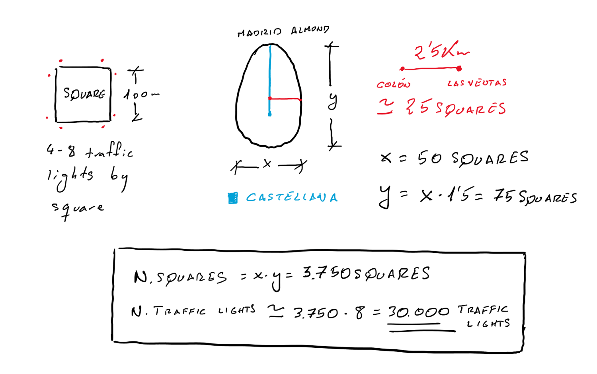
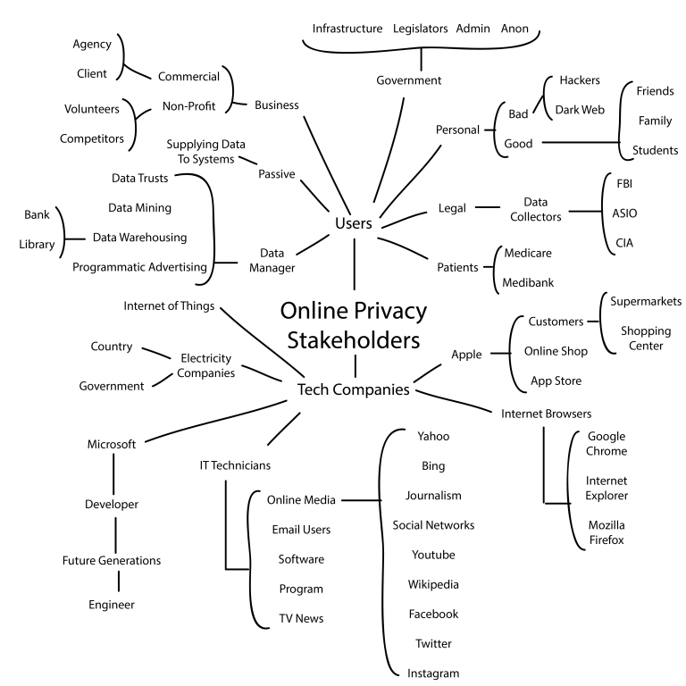
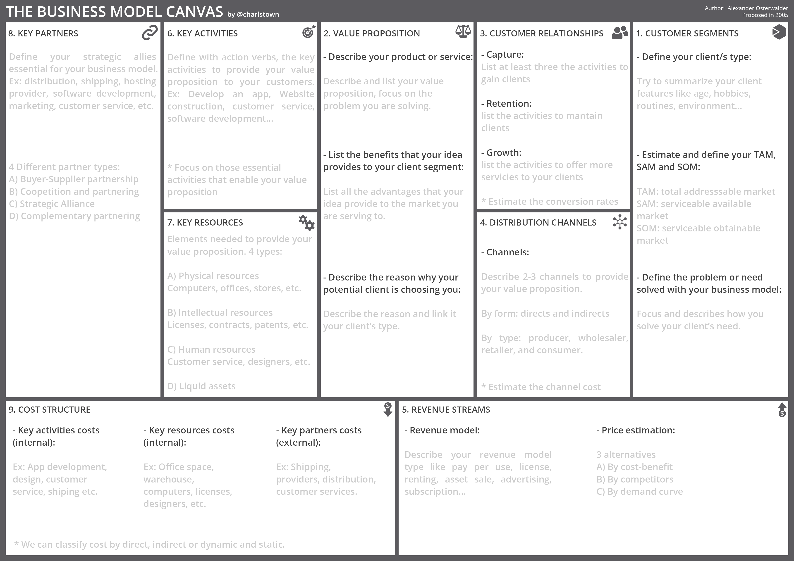

# The Business model design

Lean startup is a methodology for developing businesses and products that aim to shorten product development cycles and rapidly discover if a proposed business model is viable; this is achieved by adopting a combination of business-hypothesis-driven experimentation, iterative product releases, and validated learning.
(Ries, 2011)

"A business model describes the rationale of how an organization creates, delivers, and captures value, in economic, social, cultural, or other contexts."
(Geissdoerfer, Savaget, Evans. 2017)

## The market size

Following the definition from Alexa blog: "Market size is the number of individuals in a certain market segment who are potential buyers. Companies should determine market size before launching a new product or service."
(What is Market Size).

One of the very first steps in developing a business model is estimating the market size. It tells you and your partners, team, and investors how much potential business is out there.

### TAM, SAM, SOM

**1. TAM (Total Available Market):** is the total available universe behind the problem I want to solve with my business. You can make rough estimations from the annual market turnover.

**2. SAM (Serviceable Available Market):**  is the optimum portion of TAM targeted and served by a company's products or services (no shared market).

**3. SOM (Share of the market):** is the percentage of SAM which is realistically reached by the chosen channels.

### Great estimation examples

These problems are so entertaining. Remember, we are not looking for an exact answer, and there are many different ways of estimating the answer.  To solve this we need to break down the problem.

#### How many traffics lights are in Madrid city?

I prefer to start with a physical estimation approach like the number of buildings in a city, the number of boats in the sea... These type of estimations help you treat physical data and lose some fear of rough calculations.

##### SOLUTION A

If we want to estimate the number of traffic lights inside the road ring M-30 in Madrid, one approach could be getting the M-30 Length then the surface inside, and finally the average distance between intersections.

**Data you need to know:**
*M-30 length = 32,5km*
*The distance between intersections = 100 m*
*One intersection has 4 ligths*

{ .image-caption }

##### SOLUTION B

If we want to estimate the number of traffic lights inside the road another solution could be measuring roughly the number of urban squares inside the Madrid almond.

**Data you need to know:**
*1 Square = 100x100 m*
*One square = 8 traffic lights*
*Madrid is around x wide by 1.5x high*

{ .image-caption }

#### How many mechanics are in Madrid province?

Now let's work on a harder estimation. This is the classic example originated by Enrico Fermi. To solve this we need to break down the problem. We need to estimate the following:

- Population in Madrid province ($P_m$)

	$P_m \thickapprox 6,5 \cdotp 10^6${ .katex-sol }

- Number of total cars in Madrid ($N_{cars}$)

	$1 family \thickapprox 4 people \implies 2 cars$

	$\frac{4}{2} \simeq \frac{6,5\cdotp 10^6}{N_{cars}}$

	$N_{cars} \simeq \frac{6,5\cdotp 10^6}{2} \simeq 3,25\cdotp 10^6${ .katex-sol }

- How often each car has a breakdown per year ($N_{fixes}$)

	$(1 carcheck + 1 fix)/year$

	$N_{fixes} \simeq 2/year${ .katex-sol }

- How much time it takes to repair each car ($t_{repair}$)

	$3h > t_{repair} > 20h$

	$t_{repair} \simeq 8h${ .katex-sol }

- How much time each mechanic works per year ($t_{work}$)

	$1 worker \implies 40h \cdotp 50 weeks$

	$t_{work} \simeq 2000h/year${ .katex-sol }

##### Resolution

- Total time needed to repair all the cars in Madrid per year ($T$)

	$T = N_{cars} \cdotp N_{fixes} \cdotp t_{repair}$

	$T = 3,25 \cdotp 10^6 \cdotp 2 \cdotp 8$

	$T = 52 \cdotp 10^6 hours/year${ .katex-sol }

- Number of Mechanics in Madrid N_{mechanics}

	$N_{mechanics} = \frac{T}{t_{work}}$

	$N_{mechanics} = \frac{52 \cdotp 10^6}{2 \cdotp 10^3} $

	$N_{mechanics} = 26.000${ .katex-sol }

## The Business Model

A great example of this relation between the product and the business model could be the coffee bean as a product. 

Company A: serves coffee directly to consumers in a place where the coffee experience was about creating a sense of community. A lounge space with sofas and wifi where you feel so comfortable.
Can you guess the name of this company A? yes, it's Starbucks.

Company B: sells coffee ready to make in capsules and coffee machines with excellent design and ease of use, using a two-channel approach, retail and direct.
Can you guess the name of this company A? yes, it's Nespresso.

With these two examples, we can see how the business model is the real company product.

### 6 formulas to develop your business model

1. **Solve a real problem**: you can always start the business development process by thinking about an actual problem that needs to be solved or a solution that is barely solved.

	A great example of this situation is the hand dryer invention. Until 2006 the hand dryer used the wide jet of heated air that didn't dry the hands so well. In 2006 Dyson launches the *Dyson Airblade*, a hand dryer that uses a thin layer of unheated air traveling at around 640 k/h, drying hands in 10 seconds and using less electricity than conventional hand dryers. This innovation solved the original problem even though there was another solution already in the market.

2. **Detect opportunities in the market**: there are three areas sociological, technological, and legislative, where you can find new opportunities. From the *sociological* side, you can analyze habits, trends, population growth, etc. From the *technological* side, you can use new inventions like patents, sensors, batteries, etc. to generate new opportunities. From the *legislative* side, you can take advantage of new laws that create a problem for other entities.

3. **Analyze your competitors**: another approach could be analyzing the customers from the competitors. You can study direct and indirect customers, or not served either discontent customers. Another analysis is becoming a client from your competitors and tests the services or the products.

4. **Explore your business opportunities**: an important question you can ask yourself is: What have I learned from my actual business or the things I do? The answer to this question can give you a completely new business model. A case study for this point could be *Amazon* or *KH Lloreda* companies.

	*Amazon* started as an online library marketplace, taking advantage of the cloud and computer knowledge, they began to develop a new business model based on providing on-demand cloud computing platforms and APIs to individuals, companies, and government.

	On the other side, *KH Lloreda* started in 1949, as a metallic linings provider developing their own cleaning product due to the inexistence in the market. In 1994, the company undertook a strategic market change, focusing on cleaning products and developing *KH-7* becoming the fifth most valorized brand in Spain.

5. **Open innovation**: another method to discover new ideas is partnering with other entrepreneurs that have a great business model, product, or service but aren't able to develop their idea. You can find so many online platforms like kickstarted or ides4all where you can find new and trending ideas. You shouldn't underestimate thousands of people proposing ideas.

6. **Hybridization**: another method to develop a business model is by hybridization, mixing products with services, or vice versa. A great example of this method is the *Smartbox* company which, developed a business model using a service as a product, in this case, experiences becoming them into a gift box.

### 6 Resources by google to discover market insights for your business

These three tools are essential to analyze the market and discover the trends, ideas, and problems to solve in the actual society.

#### Google Trends

A Google website that analyzes the popularity of top search queries in Google Search across various regions and languages. The website uses graphs to compare the search volume of different queries over time.

[:octicons-arrow-right-16: Google trends](https://trends.google.com/)

#### Google Insights Library

Stay up to date with all the latest research from across Think with Google. Insights Library is your destination to search, discover, and interact with the insights that will fuel your business.

[:octicons-arrow-right-16: Google insights](https://www.thinkwithgoogle.com/tools/data-insights-library/)

#### Google Find My Audience

Find My Audience helps you understand who your most valuable customers are on YouTube — so you can discover new audiences and learn how to reach them individually with relevant messages.

[:octicons-arrow-right-16: Google find my audience](https://www.thinkwithgoogle.com/feature/findmyaudience/)

#### Google Market Finder

Free tool to identify new potential markets, discover helpful operational information and start selling to customers at home and around the world.

[:octicons-arrow-right-16: Market finder](https://marketfinder.thinkwithgoogle.com)

#### Rising Retail Categories

Use this interactive tool to understand fast-rising retail categories in Google Search, the locations where they’re growing, and the queries associated with them. The data will update daily to reflect changes in Search interests.

[:octicons-arrow-right-16: Trends category](https://www.thinkwithgoogle.com/feature/category-trends)

#### Google Grow My Store

Google offers a service to analyze your retail site, give you an overall score and offer you detailed insights and recommendations to help you strengthen your business.

[:octicons-arrow-right-16: Grow my store](https://growmystore.thinkwithgoogle.com/)

### Mapping the stakeholders

Stakeholders are those people, groups, or individuals who either have the power to affect, or are affected by the endeavour you're engaged with. Stakeholders are affected and can affect your endeavours to varying degrees, and the degrees should be considered when analysing and mapping out the stakeholder landscape.

As Lean Startup declares, the golden rule is to validate the customer environment and the product/service to discover rapidly if a proposed business model is viable. Accordingly, the next step to understand better our business model is to conduct a stakeholder analysis. This activity helps you identify project stakeholders, their expectations, and their relationships. There are three steps to follow in Stakeholder Analysis:

1. **Identify who your stakeholders are.** Think of all the people/organizations that are affected by your work. Who gives value to whom or have an interest in it.

	There are two types of stakeholders, the inside stakeholders like employees, chiefs, co-founders, etc., and the outside stakeholders like providers, society, government, clients, etc.

2. **Map your stakeholders.** A significant way to map the stakeholders is by dividing them into two different groups, the inside, and the outside. Subsequently, you can draw them by their relations following the value proposition, the buyers, and the sellers. After generating this map you should ask yourself where is located your business model inside this map.

	{ .image-caption }

3. **Understand Your Key Stakeholders.** A simple way to summarize the level of backing you have from your stakeholders is to color-code them. For example, show advocates and supporters in green, blockers and critics in red, and those who are neutral in orange.

## Business model canvas

A Business Model Canvas is a strategic management and lean startup template for developing new or documenting existing business models. It helps visualize what is important and forces users to address key areas. It can also be used by a team (employees and/or advisors) to understand relationships and reach agreements.

### 1. Customer segments

Customer segments are the community of customers or businesses that you are aiming to sell your product or services to. Customer segments is one of the most important building blocks in the business model canvas for your business, so getting this building block right is key to your success.

- **Define your client/s type:** Try to summarize your client features like age, hobbies, routines, environment...

- **Estimate and define your TAM, SAM and SOM:**

	- **TAM:** total addresssable market
	- **SAM:** serviceable available market
	- **SOM:** serviceable obtainable market

- **Define the problem or need solved with your business model:** Focus and describes how you solve your client’s need.

### 2. Value propositions

A value proposition is designed to convince a potential customer that your particular product or service will add more value or better solve a problem than your competition. It should answer the fundamental question of **“Why should I buy your product instead of your competitor’s product?”**

- **Describe your product or service:** Describe and list your value proposition, focus on the problem you are solving.

- **List the benefits that your idea provides to your client segment:** List all the advantages that your idea provide to the market you are serving to.

- **Describe the reason why your potential client is choosing you:** Describe the reason and link it your client’s type.

### 3. Customer relationships

Customer relationships describes **the type of relationship a company establishes with it’s specific customer segments.** Customer relationships are driven by customer acquisition, customer retention, and boosting sales – in other words you need to get, keep, and grow your customer relationships.

- **Capture:** List at least three the activities to gain clients

- **Retention:** list the activities to mantain clients

- **Growth:** list the activities to offer more servicies to your clients

In this section, it would be helpful to estimate the **conversion rates** from these activities.

### 4. Channels

Channels are ways for you to reach your Customer Segments. And remember that in the initial stages it’s important not to think about scale but to **focus on learning**. With that in mind try to think which channels will give you enough access to your Customer Segments at the same time give you enough learning. Channels can be email, social, CPC ads, blogs, articles, trade shows, radio & TV, webinars etc. and BTW you don’t have to be on all of them, just where your Customer Segments are.

**Channels:** Describe 2-3 channels to provide your value proposition.

- **By form:** directs and indirects

- **By type:** producer, wholesaler, retailer, and consumer.

Remember that one more channel implies one more cost too.

### 5. Revenue streams
How you price your business will depend on the type of model it is, however, it’s quite common for startups to lower their cost, even offer it for free to gain traction, however, this can pose a few problems. The key being it actually delays/avoids validation. Getting people to sign up for something for free is a lot different than asking them to pay. There is also the idea of perceived value.

- **Revenue model:** Describe your revenue model type like pay per use, license, renting, asset sale, advertising, subscription...

- **Price estimation:** 3 alternatives

	- By cost-benefit
	- By competitors
	- By demand curve

### 6. Key activities

These are really the activities that you do on a daily basis and **what you need to understand is your strengths and weaknesses to which you can play on.** These may include sales and marketing, research and development, manufacturing or distribution. Perhaps if you were an app development or software company your core focus should be to program and develop.

Define this section with action verbs. **Find the key activities to provide your value proposition to your customers.** Ex: Develop an app, Website construction, customer service, software development, etc.

Focus on those essential activities that enable your value proposition.

### 7. Key resources

This is really the part that explains how you will create your value proposition. Have a think about what types of products, services, assets you may need to create your value proposition. This often includes intellectual property, talent, and infrastructure. Perhaps you have a website that is unique, perhaps you have offices or property that are very unique.

**Elements needed to provide your value proposition. 4 types:**

- **Physical resources:** Computers, offices, stores, etc.
- **Intellectual resources:** Licenses, contracts, patents, etc.
- **Human resources:** Customer service, designers, etc.
- **Liquid assets**

### 8. Key partners

Define your **strategic allies** essential for your business model.

Ex: distribution, shipping, hosting provider, software development, marketing, customer service, etc.

**4 Different partner types:**

- Buyer-Supplier partnership
- Coopetition and partnering
- Strategic Alliance
- Complementary partnering

### 9. Cost structure

Here you should list all the operational costs for taking this business to market. How much will it cost to build your idea? What is your burn rate — your total monthly running costs? How much will it cost to interview your customer segment? How much do market research papers cost? etc. You can then use these costs and potential revenue streams to calculate a rough break-even point.

- **Key activities costs (internal):** App development, design, customer service, shiping etc.
- **Key resources costs (internal):** Office space, warehouse, computers, licenses, designers, etc.
- **Key partners costs (external):** Shipping, providers, distribution, customer services.

---

## References and links

- [What is Market Size, Alexa blog.](https://blog.alexa.com/marketing-research/market-size/#:~:text=Market%20size%20is%20the%20number,a%20new%20product%20or%20service.&text=By%20outlining%20the%20difference%20between,tackle%20that%20consumer%20sweet%20spot.)

- [steve_mullen, An Introduction to Lean Canvas.](https://medium.com/@steve_mullen/an-introduction-to-lean-canvas-5c17c469d3e0)

- [Ries, E. (2011) personal interview. 2011](https://www.fastcompany.com/1778706/eric-ries-lean-startup-machine)

- [Geissdoerfer, M., and Savaget, P., and Evans, S. (2017) The Cambridge Business Model Innovation Process](https://www.sciencedirect.com/science/article/pii/S2351978917300392?via%3Dihub)

- [Guesstimation book](https://www.amazon.es/Guesstimation-Solving-Worlds-Problems-Cocktail/dp/0691129495)