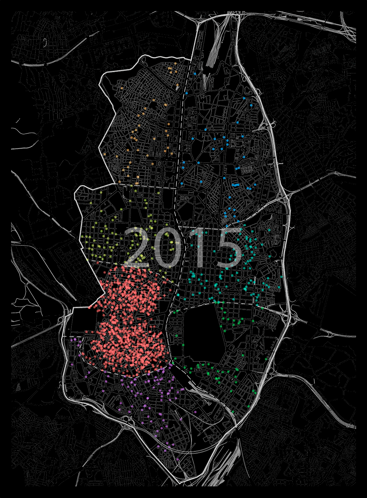

# My airbnb analysis

This research aims to process big data information from the city using data design as an urban analysis tool. For this project, it is proposed to use this tool on big data from tourist rentals in the city of Madrid, to code the information collected and display it under a visual language that allows us to see the relationships and links that occur at the urban level.

---

## Airbnb growth data analysis in Madrid

### Objectives

Test case presenting the Data Design as an urban tool and it\'s application. Applying the opportunistic sensing method where all the data used in the project was generated before for another purpose to study the Airbnb growth data analysis in Madrid.

#### Specific objectives:

- Graph the tourist renting apartment growth for each district in the Madrid central almond, from 2015 to 2018.
- Compare the tourist house rent vs. traditional house rent in the Madrid central almond, from 2015 to 2018.
- Create a digital cartography showing the affection grade of tourist renting.

### Data origins

For this project, I used data from these different websites:

- Airbnb data: [http://insideairbnb.com/get-the-data.html](http://insideairbnb.com/get-the-data.html)
- Traditional renting: [https://www.idealista.com/labs/](https://www.idealista.com/labs/)
- Cartographies: [https://datos.madrid.es/](https://datos.madrid.es)

### Data analysis contents

1. Digital cartography locating all Airbnb data as points colored by the district. One cartography per year.
2. Graph comparison showing the traditional renting vs. p2p renting evolution from 2015 to 2018.
3. Digital cartography with a lower scale showing the tourist rent affection in the Madrid Central district from 2015 to 2018.
4. Digital cartography showing a gradient map, filtering the affection of each square by the number of Airbnb apartments and the area of the square.

### Results

After the analysis, you are able to understand the 180 thousand rows from the data frame. Using the data design as a tool, the information can be coded producing a final result that makes possible the understanding of all the data with no explanations needed. Data design makes big data accessible to the reader. At the end of this post, you can see all the results of this study presented in 7 figures.

- The gif: shows the superposition of the figures from 1 to 4 presenting the Airbnb growth through the years.
- Figures 1-4: digital cartographies locating all Airbnb data as points colored by the district.
- Figure 6: tourist rent evolution in the Madrid Central district from 2015 to 2018.
- Figure 7: final digital cartography showing the affection of each urban square.
- Figure 5: graph comparison showing the traditional renting vs. p2p renting evolution from 2015 to 2018.

{data-gallery="taipei"}

{data-gallery="taipei"}

{data-gallery="taipei"}

### Other links

- You can read the whole project here: [https://issuu.com/charlstown/docs/carlos_grande-cv-isuue](https://issuu.com/charlstown/docs/carlos_grande-cv-isuue)
- More post like this here: [https://carlosgrande.me/category/projects/](https://carlosgrande.me/category/projects/)