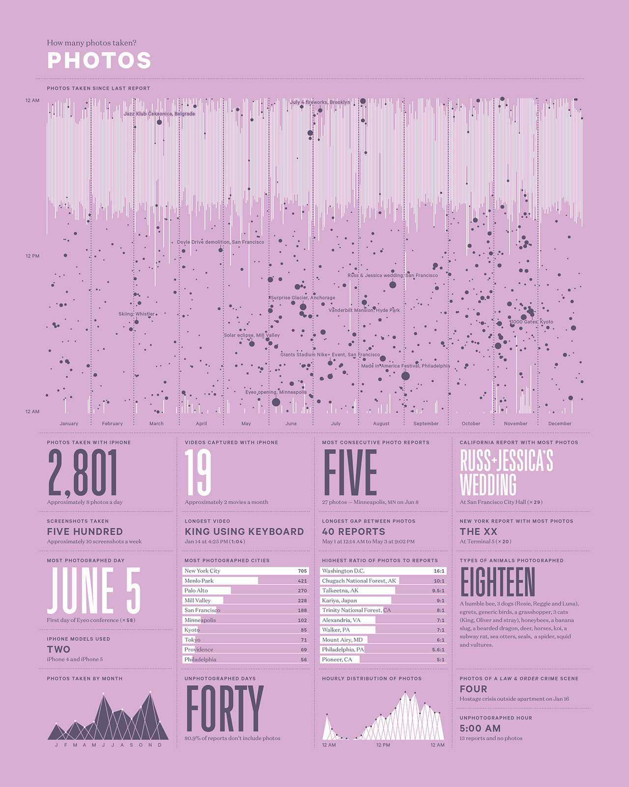

# Nicholas Felton

In this post, I wanted to introduce **Nicholas Felton**, who is the author of several Personal Annual Reports that weave numerous measurements into a tapestry of graphs, maps, and statistics to reflect the year's activities. He is the co-founder of www.Reporter-App.com, www.Daytum.com, and is a former member of the product design team at Facebook.

His work has been profiled in publications including *The New York Times*, *Wall Street Journal*, *Wired* and *Good Magazine* and has been recognized as one of the 50 most influential designers in America by *Fast Company*. He is credited with influencing the design of Facebook's timeline.

---

## Tracing My Life. By Nicholas Felton

[*The Feltron Annual Report*](http://feltron.com/FAR14.html) was first published in 2005, It was intended as a quick project in which to share my interests and habits from the previous year. I had assumed that the Report would be interesting to only friends and family, and was surprised to find it picked up by bloggers and passed around the internet. As a result of the encouragement I received this in this first year, I have continued the project and increased its scope each year since.

[...]

The challenge each year is to define an approach that will illuminate new aspects of my behavior. After a few years of straightforward accountings, I started exploring new lenses for recording the year. In 2008, I concentrate on the distances I traveled. In 2009, I asked those around me to report back on my behaviors. In 2010, I lost my father and used this project to describe his life through the fragments of data he left behind. In 2011, I combined two years of data to look at the ways in which my behavior changed depending on who I was with. Most recently I developed an iPhone app for 2012 to ping me at random intervals and record my behavior. I have already planned the methodology for 2014 and will continue the project as long as I think there are new challenges to be tackled.

The project initially served as a self-promotional piece, but has evolved fat beyond that point. It is now more of a research & development platform for exploring new dimensions of data collection and representation.

(Felton, 2015, quoted in Bihanic, 2015.)

## Gallery

{ .image-caption }

{ .image-caption }

{ .image-caption }

{ .image-caption }

{ .image-caption }

---

**REFERENCES:**

- Bihanic, D. (2015). *New challenges for Data Design**.* London: Springer-Verlag.
- Figures retrieved from [http://feltron.com/index.html](http://feltron.com/index.html "http://feltron.com/index.html")
- You can buy the book here: [https://www.springer.com/gp/book/9781447165958](https://www.springer.com/gp/book/9781447165958 "https://www.springer.com/gp/book/9781447165958")

**FURTHER READING:**

- Pitch Interactive site: [http://feltron.com/index.html](http://feltron.com/index.html "http://feltron.com/index.html")
- @feltron: [https://twitter.com/feltron](https://twitter.com/feltron "https://twitter.com/feltron")
- More articles like this here: [https://carlosgrande.me/category/case-studies/](https://carlosgrande.me/category/case-studies/)