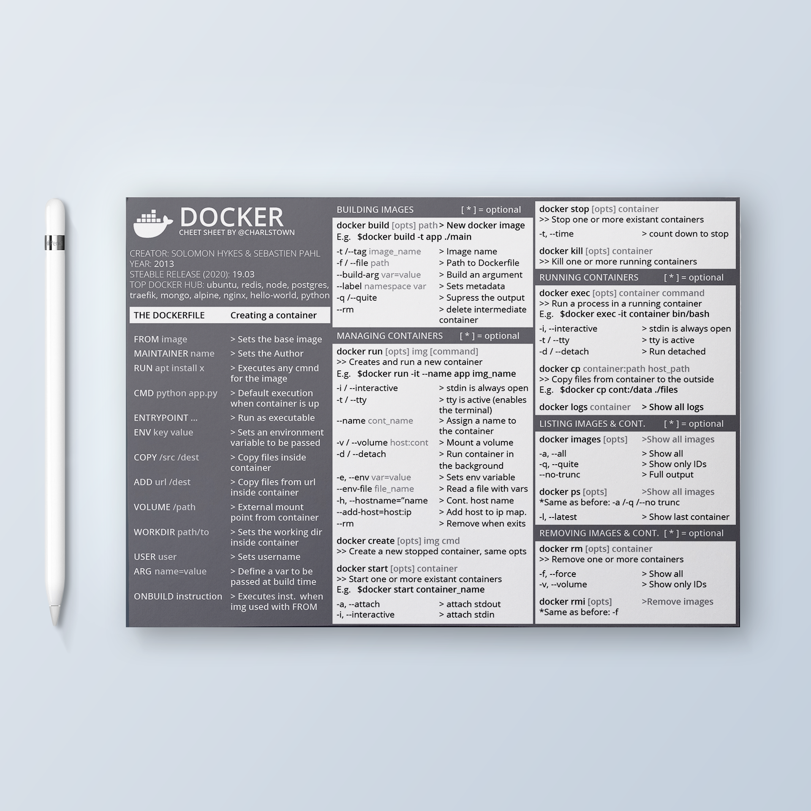
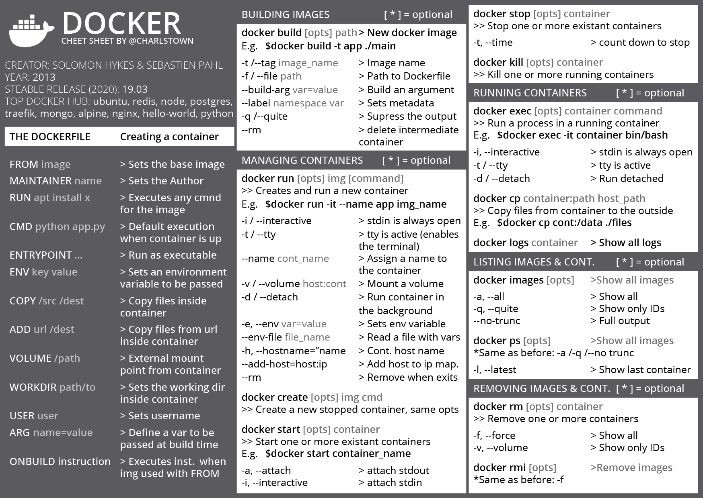

# Docker cheatsheet

{ .image-width-24 }

With this post, I wanted to share my latest Docker cheatsheet and explain some basics I founded so useful.

---

## The Docker cheatsheet

{ .image-caption }

[Download the cheatsheet](../../assets/docs/cheatsheet-docker.pdf){:download="Docker Cheatsheet" .md-button }

## What is docker?
"Docker is a set of platform as a service (PaaS) products that use OS-level virtualization to deliver software in packages called containers. Containers are isolated from one another and bundle their own software, libraries and configuration files; they can communicate with each other through well-defined channels. All containers are run by a single operating system kernel and therefore use fewer resources than virtual machines." [wikipedia](https://en.wikipedia.org/wiki/Docker_\(software))

All this sounds a lot to a **virtual machine**, so what is the main **difference**? Containers and virtual machines have similar resource isolation and allocation benefits, but function differently because **containers virtualize the operating system instead of hardware**. Containers are more portable and efficient.

<div class="grid cards" markdown>

-   CONTAINERS

    ---

    


    Containers are an abstraction at the app layer that packages code and dependencies together. Multiple containers can run on the same machine and share the OS kernel with other containers, each running as isolated processes in user space. Containers take up less space than VMs (container images are typically tens of MBs in size), can handle more applications and require fewer VMs and Operating systems.

-   VIRTUAL MACHINES

    ---

    

    Virtual machines (VMs) are an abstraction of physical hardware turning one server into many servers. The hypervisor allows multiple VMs to run on a single machine. Each VM includes a full copy of an operating system, the application, necessary binaries and libraries - taking up tens of GBs.

</div>

*Pictures from [Docker official website](https://www.docker.com/resources/what-container#/package_software).*


## How to create a Dockerfile
A **Dockerfile** is a text document that **contains all the commands** a user could call on the command line **to assemble an image**. Using docker build users can create an automated build that executes several command-line instructions in succession. 

Here you can see an **example** of a real and working **Dockerfile**. In this example, we create a container with a small Debian package and Python installed.

```
# Select a base image
FROM python:3.8-slim

# Install python & git
RUN apt-get update -y && apt-get -y install git-core\
    python3-pip \
    nano

# Copy files needed to the container
COPY code /app_folder/code
COPY data /app_folder/data
COPY requirements.txt /app_folder

# Install requirements
RUN pip3 install -r /app_folder/requirements.txt

# Select working directory inside the container
WORKDIR /app_folder

# Running the app
CMD [ "python", "./code/app.py" ]
```
</br>

## How to build and play with the container
Once you have a Dockerfile in the main folder, containerize an application is really easy.
</br>
### 1. Build an image
The first thing we need to do is to create the image, you can do with this command:
```
# docker build [opts] path_to_the_dockerfile
$docker build --tag myImage .
```
In this case, we use *--tag* in options to assign a name to the image, once done that docker starts building the image from the Dockerfile. To make sure the image was created you can do:
```
$docker images
```
And you will see a list with all the images created.
</br>
### 2. Run a container
To run a container the first thing to do is create it from the image, to do so we can use this command.
```
#docker run [opts] myimage
$docker run -it --name myContainer myimage
```
In this case, we use the option *-it* to run the container on interactive mode with tty active, and we assign a name to this container.
</br>
### 3. Accessing to a running container
Sometimes, we lunch a container but it's running in detached mode so we are not able to interact with it. We can access again to that container by the command *exec*:
```
$docker exec -it myContainer bin/bash
```
With this command, we are running the process "bin/bash" inside the running container.
</br>

## Other references and links
- [Docker documentation](https://docs.docker.com/)
- More articles like this here: [Resources](https://carlosgrande.me/category/myworks/resources-cheatsheets/)
- Github repository: [cheatsheets](https://github.com/charlstown/CodeCheatsheets)