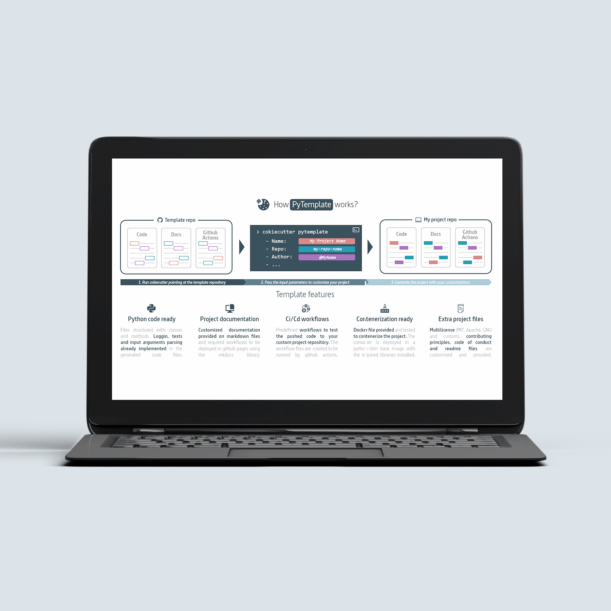
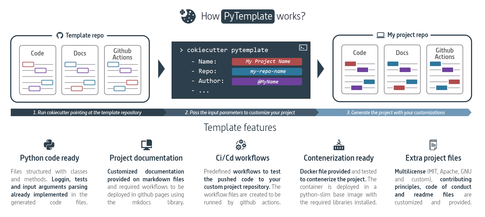
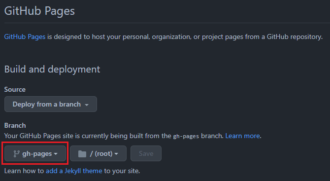

# My Python template

{ .image-width-24 }

Every time I have started a new Python project, I have spent a lot of time setting up the initial files like the README, Code of Conduct, licenses, and the base code itself to start with. Even having a template ready, the process of cloning it and starting to customize it has taken me a lot of time.

This is where **PyTemplate** comes into play. The template follows a customizable project structure using cookiecutter as the project generator. PyTemplate contains the usual files that a Python project needs, base code based on classes with an integrated logger and a Docker file to containerize your application. It also allows you to choose between multiple licenses and customize the documentation, deploying it on GitHub pages with GitHub workflows included in the template.

- **Documentation:** https://charlstown.github.io/py-template/
- **Github Repo:** https://github.com/charlstown/py-template

The easiest way to understand what PyTemplate does is to create a simple project from this template and see how it works.


## What is Cookiecutter

Cookiecutter is a Python package, easily installable with pip or other package managers, that enables you to create and use templates for microservices and software projects. It is a command-line tool that requires no knowledge of Python to use. Cookiecutter is widely used among software engineers, researchers, data scientists, and other technical roles.

{ .image-caption }

Visit these links to learn more about cookiecutter:

- **Documentation:** https://cookiecutter.readthedocs.io/
- **GitHub repo:** https://github.com/cookiecutter/cookiecutter


## What is PyTemplate

A Cookiecutter template for general python developers. Recommended for DevOps & Data Science projects. The template follows a customizable project structure using cookiecutter as the template generator.

- **Documentation:** https://charlstown.github.io/py-template/
- **Github Repo:** https://github.com/charlstown/py-template


### The project structure

There is no one "right" way to structure a Python project, as the appropriate structure can depend on the specific needs and goals of the project. However, PyTemplate applies some general guidelines and good practices when organizing the project files. A structure suitable for larger projects that consist of multiple modules and packages.

```bash
my_project/
├── my_package/
│      └── config/
│      │      ├── settings.yaml
│      │      └── additional_settings.yaml
│      ├── __init__.py
│      ├── main.py
│      ├── module_1.py
│      ├── module_2.py
│      └── ...
├── tests/
│      ├── test_module_1.py
│      ├── test_module_2.py
│      └── ...
├── data/
│      ├── input.csv
│      └── ...
├── docs/
│      ├── index.md
│      └── ...
├── README.md
├── requirements.txt
├── LICENSE
└── ...
```

You can visit my post about [My Python project cheatsheet](https://carlosgrande.me/my-python-project-cheatsheet/) to learn more about this structure.


## PyTemplate demo in action

To create a new project from the template you need to install cookiecutter and follow these instructions.


### 1. Cookiecutter installation

Installing cookiecutter package is very easy, you can simply run the next command to install it.

```bash
pip install cookiecutter
```

Visit the link to the [cookiecutter documentation](https://cookiecutter.readthedocs.io/en/stable/installation.html#install-cookiecutter) to learn more about the installation.

!!! tip

	It is recommended to create a virtual environment and install the cookiecutter library inside this environment.


### 2. Running the template

Run the cookiecutter command followed by the template repository URL. When this command is finished, it generates a folder with your project name and all the template files customized.

```bash
python -m cookiecutter https://github.com/charlstown/py-template.git
```

### 3. Customizing the template

Fill out the form in the console to customize the template and the project will be generated at the end.

{ .image-caption }


You should see a new folder with the repository name you gave as input (**my-python-project**).

Congrats! &#x1f387; You finally installed your template to start coding your project!


### 4. Pushing the project to Github

In this step we want to push the repository to our github account.

- **Create a new repository in github:**

	Create the new repository and make sure you give it the same name of the project folder, in our case *my-python-project*.

	*Don't add any predefined file from github in the new repository, all the files are included in the local project folder.*

- **Push the local repository:**

	```bash
	git remote add origin https://github.com/charlstown/my-python-project.git
	git branch -M main
	git push -u origin main
	```

After pushing the project the github workflow *On Push Deploy Documentation* will create a new branch called *gh-pages*.

This branch contains the documentation files in html ready to be published in Github Pages.


### 5. Deploying the documentation in Github

Deploy your documentation in Github pages is so easy, you only need to set the pages configuration pointing at the *gh-pages* branch generated by our github action *On Push Deploy Documentation*.

1. Go to the repository settings.
2. Select *Pages* at the settings menu under the *code and automation* section.
3. Make sure pages is enable and select *gh-pages* as the site branch under *Build and deployment* section.

{ .image-caption }


**Your site should be live at: [https://user.github.io/my-python-project/](https://user.github.io/my-python-project/)**

Remember, to deploy the documentation in Github Pages the repository must be a public repository.

---

## References and links

- [Pytemplate Documentation](https://charlstown.github.io/py-template/)
- [Pytemplate repository](https://github.com/charlstown/py-template)
- [Cookiecutter Documentation](https://cookiecutter.readthedocs.io/)
- [Cookiecutter repository](https://github.com/cookiecutter/cookiecutter)
- [Mkdocs main page](https://www.mkdocs.org/)
- [Mkdocs documentation](https://github.com/mkdocs/mkdocs/blob/master/docs/index.md)
- [Mkdocs introductory tutorial](https://github.com/mkdocs/mkdocs/blob/master/docs/getting-started.md)
- [Material for Mkdocs](https://squidfunk.github.io/mkdocs-material/)
- [Github Actions documentation](https://docs.github.com/es/actions)
- [Github Actions marketplace](https://github.com/marketplace?type=actions)
- [Github Pages documentation](https://docs.github.com/es/pages)
- [More Resources like this here](https://carlosgrande.me/#resources-cheatsheets/)

